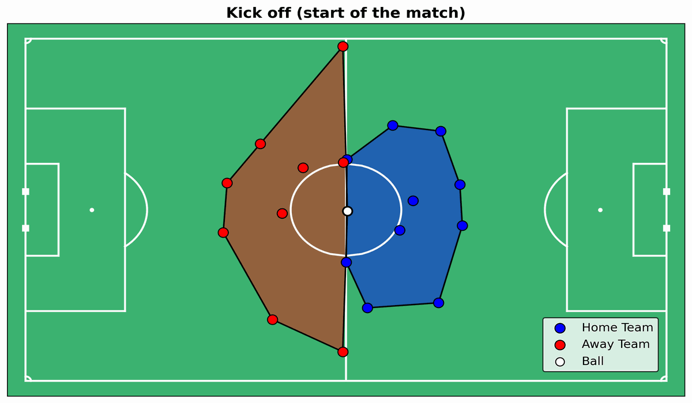

# Copula-based Hidden Markov Model (HMM) to decode football tactics

<div style="text-align: center;">
    
</div>

## About the project

This project was developed by me and my friend [Alessio Valentinis](https://github.com/ValentinisAlessio/) as part of the course *Probabilistic Machine Learning* of the MSc degree in Data Science and Artificial Intelligence (DSAI), University of Trieste.

The project aims to infer on the Effective Playing Space (EPS) identified by the players of a football match. More precisely, we relied on a copula-based Hidden Markov Model with the main goal to interpret the hidden states of the model as different tactical phases of the match.

The project is implemented using Python, in particular relying on the following libraries:
- `numpy`
- `pandas`
- `matplotlib`
- `seaborn`
- `torch`
- `pyro`

For the implementation of the HMM we relied on the Probabilistic Programming Language Pyro.
All the functions used to define and train the model are implemented in the `models` folder. Other helper functions are implemented in the `utils` folder, such as the functions to compute the EPS, to plot and create GIFs of the pitch.

All the code regarding data cleaning, training of the model, and inference is implemented in the Jupyter Notebooks in the root folder.

## Files

```
├──📂data 
│   ├── hulls_df_matchday2.csv
│   ├── hulls_df_matchday2_reduced.csv
│   └── Sample_Game_2
│       ├── Sample_Game_2_RawEventsData.csv
│       ├── Sample_Game_2_RawTrackingData_Away_Team.csv
│       └── Sample_Game_2_RawTrackingData_Home_Team.csv
│
├── 🧹DataCleaning.ipynb
│
├── 🔎 MatchAnalysis.ipynb
│
├── ⚖️ ModelComparison.ipynb
│
├──📂models
│   ├── BivariateHMM.py
│   ├── CopulaHMM.py
│   └── UnivariateHMM.py
│
├── 📂parameters
│
├── 📊plots
│
├── ⚙️utils
│   ├── ConvHulls.py
│   ├── CopulaHelpers.py
│   ├── Metrica_IO.py
│   ├── Metrica_Viz.py
│   └── Plots.py
│
└── 🤯VarInference.ipynb
```
## Data

The data used for the project is provided by the company [Metrica Sports](https://metrica-sports.com), which provides tracking data for 3 anonymous football matches. The data is stored in the `data` folder, and it is organized in the following way:
- `Sample_Game_1`: the raw tracking data for the second match of the first matchday.
- `Sample_Game_2`: the raw tracking data for the second match of the second matchday.
- `away_xy.csv`: the x and y coordinates of the away team for the second match of the second matchday.
- `home_xy.csv`: the x and y coordinates of the home team for the second match of the second matchday.
- `hulls_df_matchday2.csv`: the hulls of the EPS for each frame of the match
- `hulls_df_matchday2_reduced.csv`: the hulls of the EPS for each frame of the match, grouped by 2 seconds, and cleaned from time intervals where the match stopped.
- `matchday2_events.csv`: the events of the match, such as goals, fouls, etc.

